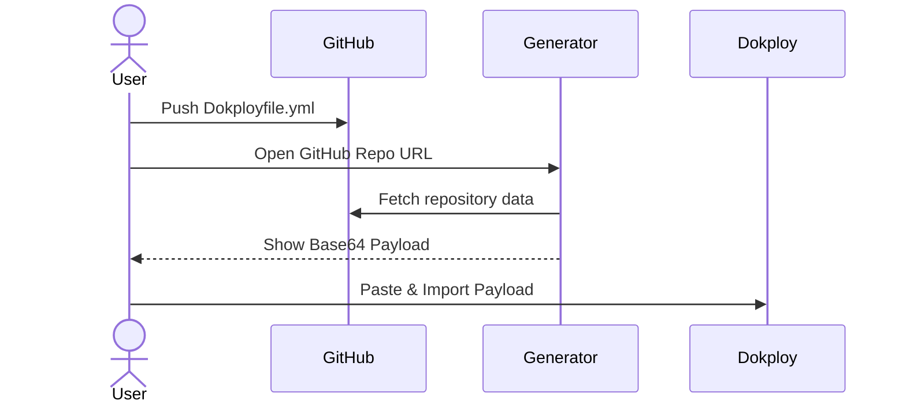
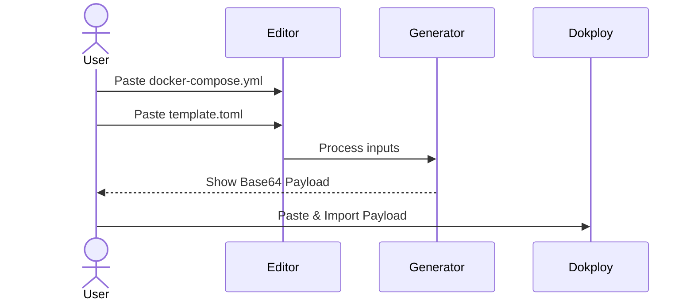

# Dokployfile Concept & Template Generator

A browser-based service to generate Dokploy template import payloads from GitHub repositories.

The `Dokployfile.yml` serves as a standard, recognizable configuration file. Its presence in a repository immediately signals that the project is deploy-ready with Dokploy and contains a pre-configured template.

## How to use

1.  Add a `Dokployfile.yml` to the root of your repository.
2.  Add your `docker-compose.yml` and `template.toml`.
3.  Go to `https://dealenx.github.io/Dokployfile/your-username/your-repo` to get your import string.
4.  Optionally add a badge to your README:

```markdown
[](https://dealenx.github.io/Dokployfile/your-username/your-repo)
```

## Workflows

### Automated (GitHub)

Best for public repositories. Just add a `Dokployfile.yml` and use the URL.



### Manual (Editor)

Best for private repositories or local testing. Paste your YAML directly into the [Generator](https://dealenx.github.io/Dokployfile/generate).



## Dokployfile.yml Format

```yaml
version: "1"

meta:
  slug: "my-app"
  name: "My Awesome App"
  version: "1.0.0"
  description: "A cool app for cool people"
  logo: "logo.png"
  tags: ["web", "automation"]
  links:
    github: "https://github.com/..."
template:
  compose: "docker-compose.yml"
  config: "template.toml"

> **Tip:** Files don't have to be in the root. You can specify relative paths (e.g., `deploy/docker-compose.yml`).
```

## Example

You can find a real-world example here: [dokployfile-template-databasus](https://github.com/dealenx/dokployfile-template-databasus)

**Dokployfile.yml**

```yaml
version: "1"
meta:
  slug: "databasus"
  name: "Databasus"
  version: "1.0.0"
  description: "PostgreSQL backup tool with MySQL and MongoDB support"
  logo: "postgresus.svg"
  tags: ["PostgreSQL", "backup", "tool", "MySQL"]
  links:
    website: "https://databasus.com"
    github: "https://github.com/databasus/databasus"
template:
  compose: "docker-compose.yml"
  config: "template.toml"
```

## Development

```bash
pnpm install
pnpm dev
```

## License

MIT
